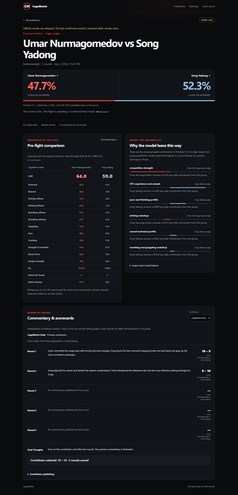
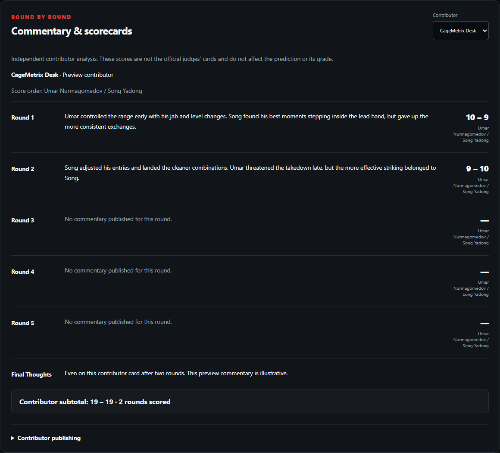
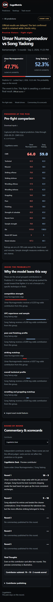
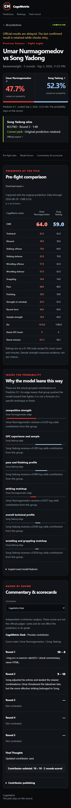

# Fight pages and contributor cards

Every bout with a saved prediction has a permanent `/fights/{bout_id}` URL. Both upcoming cards and the prediction history link to it. Cancelled originals and replacement matchups keep different IDs, inputs and commentary. Related saved matchups for the same official card slot link to one another. The default view selects Predictor 0.1; `?prediction={prediction_id}` opens another saved model record without replacing the original. Archived Elo probabilities remain labeled as Elo.

## Immutable prediction inputs

Migration `0008_fight_details.sql` adds `predictions.input_snapshot_json`. New forecasts insert their probability and the full input snapshot in the same immutable row. The snapshot contains the two fighter names/slugs, all unrounded CMR rating inputs and component evidence, source hash/date, model identity, parameters, 24 feature values, coefficients, contributions and all nonzero grouped drivers. Elo fallback forecasts store the actual Elo difference and frozen slope instead, explicitly leaving unrated CMR statistics unavailable. No coefficients, feature definitions, forecasting calculations or CMR methodology change.

Existing predictions use the write-once `prediction_snapshots` archive. `backfill-prediction-snapshots.mjs` selects ratings only by the prediction's exact source hash and CMR version. It requires one unambiguous archived row per rated fighter, a pre-lock source date, and agreement with the saved probabilities and driver contributions (tolerance `1e-12` for floating-point serialization). It never changes the saved probability. Missing or inconsistent archives produce an explicit unavailable record, never current ratings passed off as historical inputs. A neutral-start fallback is recognized only when it was documented in the saved prediction. A second backfill is a no-op.

Deployment applies the schema, runs this archive recovery **before** rating refreshes, then uses the existing refresh/forecast/deploy sequence. No production changes are required to review this PR. The original prediction update trigger remains in place; delete guards protect saved predictions and recovered snapshots. Predicted bout identities cannot be reassigned, while official status/result updates remain allowed.

Fight page reads never join current ratings. They select the saved JSON directly. The download includes full-precision inputs; the comparison table rounds for readability. A later fighter-name change, rating refresh, official result correction, or commentary edit cannot alter those displayed pre-fight inputs.

## Results and refresh

`src/live-results.ts`, its parser, two-minute cron and final-result confirmation logic are unchanged. Fight pages read the same `bouts`, `event_result_sync` and `bout_result_observations` records used by the live counter. A visible fight page refreshes every 30 seconds and retains its content when a request fails. “Event live” describes the card window; it does not claim a specific bout is currently in progress. Original probabilities and pre-fight inputs remain visible after completion. Draws, no contests and cancelled bouts are excluded consistently with the live record.

## Named contributors without accounts

`contributors` stores a public name, slug and bio. `contributor_keys` stores revocable SHA-256 hashes of random 256-bit publishing keys. One contributor may have multiple keys, and many contributors may cover one fight. There is no public sign-up, password, email or account profile. Publishing keys grant access only to their contributor's cards; the request body cannot choose a different author. Keys never appear in public API responses or browser storage.

An operator with D1 access creates a key:

```sh
npm run contributor -- create --slug cagemetrix-desk --name "CageMetrix Desk" --remote
```

The CLI writes the key to an ignored `.cache/contributors/` file and prints the revocation ID. Share the key privately with the contributor. On any fight page, expand **Contributor publishing**, paste the key, and connect. Edit Round 1–5 and Final Thoughts, then publish. Publishing makes the card public. The browser retains the key only in memory; disconnecting or closing the page clears it.

```sh
npm run contributor -- revoke --key-id THE-KEY-ID --remote
```

Use `--local --persist-to PATH` for isolated testing. The test keys in `tests/helpers/fight-fixture.mjs` are **fixtures only** and are never provisioned in production. Contributor records are not automatically created during deployment; an operator must provision the first named contributor.

Each contributor has one D1 card per bout. Writes replace the whole card atomically, guarded by an optimistic revision number; stale editors receive HTTP 409 and retain their unsaved text. API and database validation require unique rounds, text limits and paired valid MMA scores: 10–9, 10–8, 10–7, 10–10 or their reverse. Unscored rounds use two null scores. Totals sum only scored rounds and are explicitly contributor subtotals, not official judges' cards. Round text and scores open at event start, are limited by scheduled rounds and the final ending round, and cannot be published on cancelled matchups. Final Thoughts may stand alone. All five round sections remain visible, with unplayed rounds labeled. Commentary displays no timestamps. All text is rendered as text, including text that resembles HTML.

## API

| Route | Behavior |
| --- | --- |
| `GET /api/fights/{bout_id}` | Immutable selected prediction/snapshot, other saved models, status/result/source health, related replacements and contributor cards. Optional `prediction` query selects an archived prediction belonging to this bout. |
| `GET /api/fights/{bout_id}/snapshot` | Download the selected prediction and original full-precision input snapshot as JSON. |
| `GET /api/contributors/me` | Resolve a valid Bearer publishing key to its public contributor identity. |
| `PUT /api/fights/{bout_id}/commentary` | Publish that key owner's card: `{revision, rounds:[{round,text,score_a,score_b}], final_thoughts}`. Revision 0 creates; later saves use the current revision. |

Unknown fights or prediction IDs from another bout return 404; unsupported methods return 405. Fight JSON and pages use `no-store` so results and revocations are not concealed by stale caches. The Predictions API retains its 15-second cache. Fight metadata is rendered on the server from the selected record with a fixed trusted canonical origin and escaped title/description/Open Graph/X fields. Unknown pages are 404/noindex. Fight pages use text social cards because no licensed fighter image is attached.

## Validation and screenshots

```sh
npm run typecheck
npm test
npm run build
npx playwright install chromium
npm run test:fights:e2e
```

The E2E command creates an isolated local D1 database, applies and reapplies migrations, starts a test-only Worker entry point, tests five bout states and publication, captures desktop/mobile screenshots, replays the **unmodified** production live sync against a deterministic official-feed fixture, checks idempotence/error retention and snapshot stability, and stops its server. It never uses production credentials. `PLAYWRIGHT_EXECUTABLE_PATH` can point to an installed Edge/Chromium executable; CI installs Playwright Chromium. `FIGHT_TEST_PORT` defaults to 8791.

The screenshots below use explicitly labeled preview fixtures. Their ratings, commentary and prospective results are illustrative; they are not production predictions.





